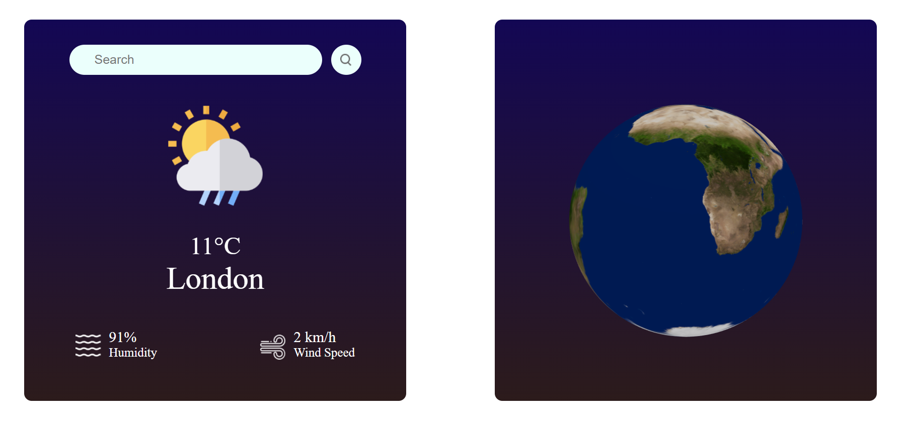

# This project create with React and openweathermap API

A Weather App using React JS. Here we get the current Weather data using API from OpenWeatherMap and display the weather information like Temperature, Weather condition, Humidity and Wind Speed according to the city in this Weather app. Also including interactive 3js animation (rotateable 3D Earth )

## Available on this Site

Runs the app in the development mode.\
Open [https://weather-app-31-8-23.netlify.app/](https://weather-app-31-8-23.netlify.app/) to view it in your browser.

- Features:
- Users should be able to input the name of a city to fetch the weather details.
- Display the weather data such as temperature, humidity, wind speed, weather condition (sunny, cloudy, etc.).
- Display a 3D globe which including interactive 3js animation (rotateable 3D Earth )

